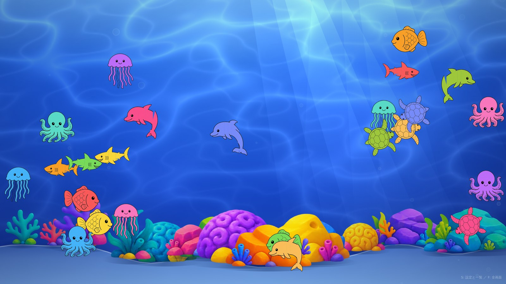

# お絵かき水族館（仮）企画書

- 提出先: 〈会場名〉 ご担当者さま
- 開催希望日: 〈2026年◯月◯日（◯）〉
- 実施時間: 〈10:00〜16:00〉
- 提出: 〈氏名／連絡先〉
- 更新: 2026-08-18

---

## 1枚でいうと

**子どもが塗った魚が、その場で大画面の海を泳ぎ出す体験です。**

塗り終わった紙をスキャナに通すだけで、**約3秒後**にその絵が水槽の中を泳ぎ始めます。
自分の絵を探して、指をさして、親を呼ぶ。**この瞬間を作るための企画**です。

塗り絵なので**絵が苦手な子でも参加できます**。塗った紙は**持ち帰れます**。

**机・椅子・モニター・機材・画材まで、すべてこちらで持ち込みます。**
会場にお借りするのは**場所だけ**です。
**インターネットは使いません**（Wi-Fi をお借りする必要がありません）。
**音も出しません**。個人情報も一切いただきません。

---

## 来場者の体験

### 何が起きるか

大きなモニターの中に、青い海が広がっています。光の筋が水面から差し込み、
砂地には色とりどりの岩とサンゴが並んでいます。その中を、**子どもたちが塗った絵**が
泳いでいます。1匹ずつ、みんな違う色です。

子どもは机で台紙を塗ります。塗り終わったらスタッフに渡します。
スタッフが紙をスキャナに通すと、**約3秒後**、いま塗ったばかりの絵が
**画面の奥からふわっと現れて、泳ぎ始めます。**

ここで必ず起きるのが「**あっ、わたしの！**」です。
子どもは画面に駆け寄って自分の絵を指さし、親を呼びます。
親はスマホを構えます。**この10秒のために全部を作っています。**

### 流れ（1人あたり 5〜10分）

| | やること | 時間 | ここでの狙い |
|---|---|---|---|
| 1 | 6種類の台紙から1枚選ぶ | 30秒 | **選ぶ**という行為で自分のものになる |
| 2 | 好きな色で塗る | 3〜7分 | 塗るだけなので**失敗しない**。絵が苦手でも参加できる |
| 3 | スタッフに渡す → スキャン | 20秒 | 待たせない。**機械の操作は見せない** |
| 4 | **画面に自分の絵が現れる** | 1〜3分 | 「自分がやったことが、大きな画面を変えた」 |
| 5 | 塗った紙を持ち帰る | — | 家でもう一度話題になる |

### なぜこの形にしているか

- **塗り絵にした理由。** 白紙に「魚を描いて」と言うと、描ける子と描けない子が分かれます。
  台紙にすれば**全員が同じスタートライン**に立てて、しかも**必ず魚に見えるまま泳ぎます**
- **3秒にこだわる理由。** 「あとで映ります」では、自分がやったこととの因果が切れます。
  **その場で泳ぎ出す**から、驚きと達成感になります
- **絵を変えない。** はみ出した色も、塗り残しも、そのまま泳ぎます。
  きれいに直してしまうと「自分の絵」ではなくなります
- **50匹まで。** 増え続けると自分の絵を見失います。**最新の50匹だけ**が泳ぎ、
  古い絵は画面の外へ泳いで去っていきます（消えるのではなく、去る）
- **絵どうしが避け合う。** 重なったままだと自分の絵を見つけられません

### 生き物ごとに泳ぎ方が違います

同じ海に6種類がいて、**動きで見分けられます。** 自分が塗ったのがどれか、すぐ分かります。

| 台紙 | 泳ぎ方 |
|---|---|
| 魚 | 尾びれを振りながら進み、画面の端まで行くと向きを変えて戻ってくる |
| イルカ | すいすい泳ぎ、**ときどき水面へ大きく跳ねる** |
| サメ | 魚を見つけると**急に速くなって追いかける**（追いつきはしません） |
| タコ | 足を波打たせながら、ゆっくり上下に漂う |
| クラゲ | ほとんど進まず、その場でふわふわ |
| ウミガメ | 前足と後ろ足を漕ぎながら、**S字を描いて**進む |

> サメが魚に**追いつかない**のは意図的です。「食べられた」に見えると、
> その絵を描いた子が悲しむからです。

### 年齢による楽しみ方

| | 楽しみ方 |
|---|---|
| 未就学児 | 塗ること自体が楽しい。画面では**色で自分の絵を探す** |
| 小学生 | 色の塗り分けや模様で工夫する。**動きの違い**に気づいて見比べる |
| 保護者 | 撮影する。子どもが自分の絵を見つける瞬間を記録できる |

### 混雑したとき

- 塗る席は**6席**用意します。1時間あたり **30〜50人**が目安です（塗り時間5分想定）
- 塗るのに時間がかかっても、**待ち行列はスキャンの20秒だけ**です。
  塗っている人が滞留するだけで、機械の前には並びません
- 台紙は持ち帰って**あとから塗って戻ってきてもらう**こともできます

---

## 会場にお借りするのは「場所」だけです

| | 内容 |
|---|---|
| 場所 | **3m×3m 程度**（塗る机と、モニターを見る立ち位置が取れる広さ） |

**それ以外はすべてこちらで持ち込みます。** 机も椅子もモニターも画材もです。
**インターネット（Wi-Fi）も使いません。** 会場のネットワークには一切つなぎません。

### 電源だけ、ご相談させてください

機材（PC・スキャナ・モニター）で **合計 約300W** を見込んでいます。

| | やり方 | 会場側の手間 |
|---|---|---|
| A（希望） | **コンセントを1口お借りする** | 場所を決めていただくだけ |
| B | **ポータブル電源を持ち込む** | **ゼロ**。電源もお借りしません |

Bでも1日は十分もちますので、**電源をお貸しいただけない場合でも実施できます。**
ご都合の良いほうをお知らせください。

---

## こちらで持ち込むもの（すべて）

| | 品目 |
|---|---|
| 機材 | ノートPC 1台（ソフト導入済み）、スキャナ 1台、**モニター 1台**（40インチ以上） |
| 什器 | **長机 2台**（塗る用・機材用）、**椅子 4〜6脚**、机の養生シート |
| 画材 | 塗り絵の台紙（6種類・〈200〉枚）、クレヨン／色鉛筆 一式 |
| その他 | 延長コード、養生テープ、HDMIケーブル、**ゴミ袋**、案内の紙 |

失敗した紙やゴミも**こちらで持ち帰ります**。

---

## 当日の流れ

| 時刻 | 内容 |
|---|---|
| 〈9:00〉 | 搬入・設営（**30分**で完了します） |
| 〈9:30〉 | 動作確認（実際に1枚通して確認） |
| 〈10:00〉 | 開始 |
| 〈16:00〉 | 終了 |
| 〈16:20〉 | 撤収（**20分**） |

**運営は1〜2名**です。混雑していなければ1名で回ります
（案内とスキャンだけで、機械の操作はほぼありません）。

---

## 会場側の心配ごとへの回答

| ご心配 | 回答 |
|---|---|
| ネットワークを使いますか | **使いません。** 会場のWi-Fiも有線も不要です |
| 音は出ますか | **出しません。** 静かな展示です |
| 個人情報を集めますか | **集めません。** 名前も写真も年齢もいただきません。残すのは絵の画像だけです |
| 絵は誰かに公開されますか | **しません。** その場のモニターに映るだけで、外部には一切送りません |
| 机や椅子はお借りできますか | **不要です。** こちらで持ち込みます |
| モニターは用意が必要ですか | **不要です。** こちらで持ち込みます |
| 汚れませんか | クレヨン・色鉛筆のみです（絵の具・液体は使いません）。**机はこちらの持ち込みで、養生シートを敷きます** |
| 子どもが機械を触りませんか | 機材は机の奥に置き、来場者は触りません。**操作するのはスタッフだけ**です |
| コード類は危なくないですか | 床を通る線は養生テープで固定します |
| 途中で止まりませんか | 万一PCが止まっても、**再起動すればそれまでの絵は全部残ります**。塗った紙も手元に残るので、通し直せます |
| 片付けは | 持ち込んだものを全部引き上げ、ゴミも持ち帰ります。**跡は残りません** |
| 費用の負担は | **ありません。** お借りするのは場所（と、可能であれば電源1口）だけです |

---

## この企画のねらい

- **待たせない。** 塗り終えてから泳ぎ出すまで約3秒です。「描いて終わり」にしない
- **見つけられる。** 同時に泳ぐのは最新の50匹まで。増えすぎて自分の絵を見失わないようにしています
- **持ち帰れる。** 紙は本人のものです。画面の中と手元の両方に残ります
- **繰り返せる。** 1人が2枚描いても仕組みは変わりません

---

## 費用

| 項目 | 金額 | 備考 |
|---|---|---|
| 台紙の印刷 | 〈◯〉円 | 〈200〉枚 |
| クレヨン・色鉛筆 | 〈◯〉円 | 使い回し可 |
| 機材 | 0円 | 手持ちのPC・スキャナ・モニターを使用 |
| 什器（机・椅子） | 〈◯〉円 | レンタルする場合。手持ちがあれば0円 |
| ソフト | **0円** | 自作。月額費用も発生しません |
| 合計 | **〈◯〉円** | |

---

## 現在の状態（正直に）

- ソフトは**完成して動いています**。塗った紙をスキャンして泳ぐところまで通しで確認済みです
- ただし**会場と同じ環境での通し稽古はこれからです**（〈◯月◯日〉に実施予定）。
  そこで確認するのは「実際の紙と照明で正しく切り抜けるか」「長時間動かして落ちないか」の2点です
- 台紙6種は完成していますが、**印刷用に作り直し中**です（いまのデータは印刷すると線が粗いため）

---

## ご相談したいこと

1. **設置場所**（人の流れの中か、少し外れた落ち着ける場所か）
2. **電源**（コンセントを1口お借りできるか。難しければポータブル電源を持ち込みます）
3. **想定来場者数**（台紙の枚数を決めるために伺いたいです）
4. **当日の搬入・搬出の経路と時間**（台車が使えるかどうかも伺えると助かります）
