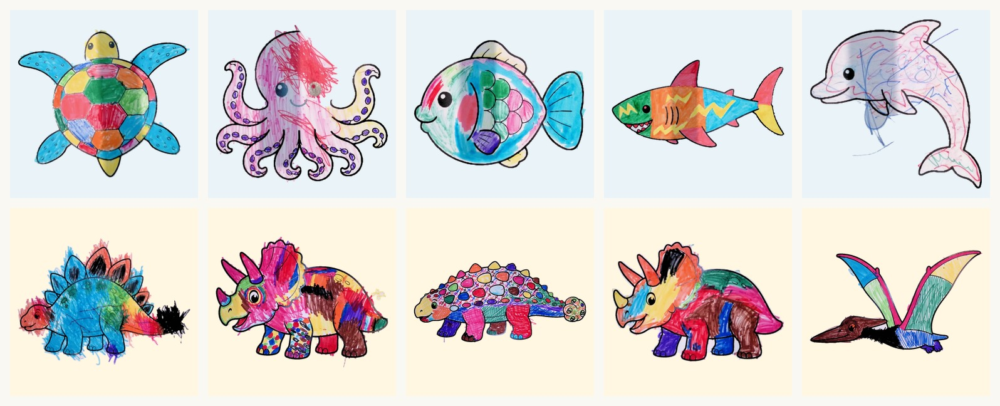
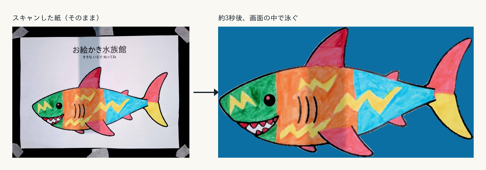
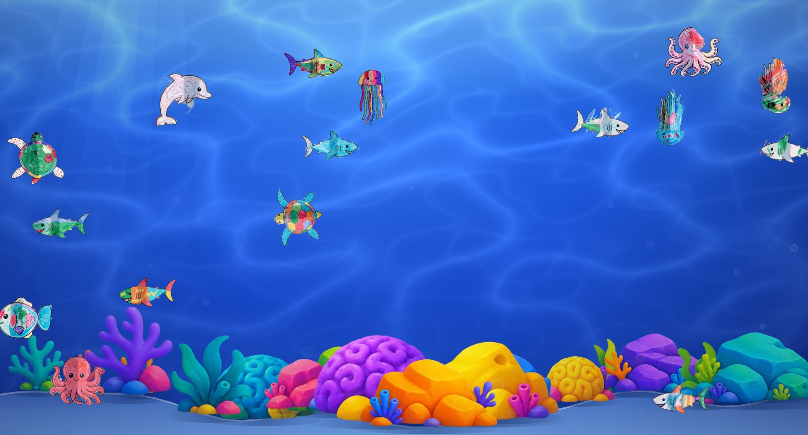
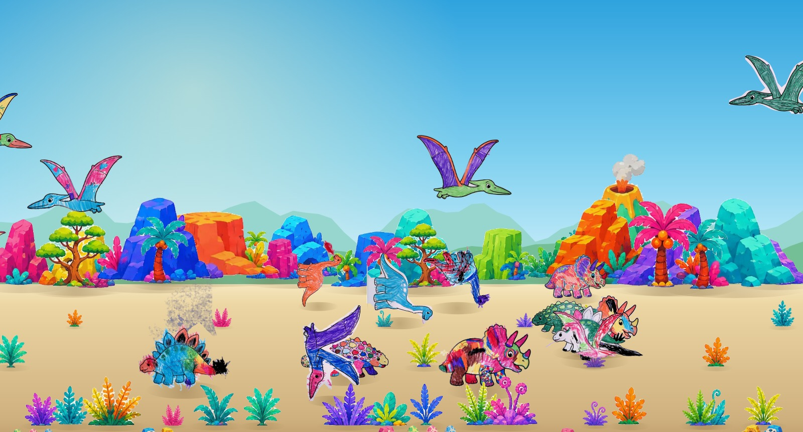

# お絵かき水族館・お絵かきダイナソー 企画書

- 提出先: 〈会場名〉 ご担当者さま
- 開催希望日: 〈2026年◯月◯日（◯）〉
- 実施時間: 〈10:00〜16:00〉
- 提出: 〈氏名／連絡先〉
- 更新: 2026-09-09
- 体裁を整えた版（会場へ渡す用）:
  - PDF: `docs/お絵かき水族館-企画書.pdf`（A4・8ページ。そのまま印刷・添付できる）
  - PowerPoint: `docs/お絵かき水族館-企画書.pptx`（スライド10枚。費用・氏名・開催希望日は入れていない）
  - Web: https://claude.ai/code/artifact/119fb141-8c35-4523-87f3-eddc68d7a4d8
  （このファイルが原本。文言を直したら、上の3つも作り直す）

---

## 1枚でいうと

**子どもが塗った絵が、その場で大画面の中を泳ぎ・歩き出す体験です。**

塗り終わった紙をスキャナに通すだけで、**約3秒後**にその絵が画面の中で動き始めます。
自分の絵を探して、指をさして、親を呼ぶ。**この瞬間を作るための企画**です。

塗り絵なので**絵が苦手な子でも参加できます**。塗った紙は**持ち帰れます**。

「**お絵かき水族館**」（海の生き物6種・泳ぐ）と「**お絵かきダイナソー**」（恐竜5種・歩く／飛ぶ）の
**2つの世界から選べます**。会場の広さに応じてどちらか1つでも、両方でも実施できます。

**机・椅子・モニター・機材・画材まで、すべてこちらで持ち込みます。**
会場にお借りするのは**場所だけ**です。
**インターネットは使いません**（Wi-Fi をお借りする必要がありません）。
**音も出しません**。個人情報も一切いただきません。

---

## 実施実績

**すでに2会場で、のべ630人のお子さまに参加いただいています。**

| 会場 | 実施期間 | 参加人数 |
|---|---|---|
| イオン久御山店 | 2日間 | **420人** |
| イオン大日店 | 2日間 | **210人** |
| **合計** | **4日間** | **630人** |

- 来場層は**ファミリーが中心**でした。想定どおり、未就学児〜小学生とその保護者に
  受け入れられています。
- 体験の終わりに**アンケートへ案内する導線もスムーズ**でした。塗り絵が終わって
  自分の絵が泳ぎ・歩き出すのを見届けたあとの、来場者の気持ちが乗った状態で
  次の案内（アンケート等）に移れています。
- 運用中に見つかった細かな不具合（紙の撮り方の癖による切り抜きの精度など）は
  その都度記録し、原因を突き止めて直しています。**実際に集まった紙・写真データを
  使って検証済み**です（後述「現在の状態」）。

---

## 来場者の体験

### 何が起きるか

塗った紙をスキャナに通すと、**紙の色も、はみ出た線も直さずそのまま**、
約3秒後に画面の中で動き出します。上の写真は実際に会場で塗られた1枚です。

大きなモニターの中に、青い海（または恐竜のいる平原）が広がっています。
その中を、**子どもたちが塗った絵**が泳いで（歩いて）います。1匹ずつ、みんな違う色です。

子どもは机で台紙を塗ります。塗り終わったらスタッフに渡します。
スタッフが紙をスキャナに通すと、**約3秒後**、いま塗ったばかりの絵が
**画面の奥からふわっと現れて、動き始めます。**

ここで必ず起きるのが「**あっ、わたしの！**」です。
子どもは画面に駆け寄って自分の絵を指さし、親を呼びます。
親はスマホを構えます。**この10秒のために全部を作っています。**

### 流れ（1人あたり 5〜10分）

| | やること | 時間 | ここでの狙い |
|---|---|---|---|
| 1 | テーマ・台紙を選ぶ（水族館6種／恐竜5種） | 30秒 | **選ぶ**という行為で自分のものになる |
| 2 | 好きな色で塗る | 3〜7分 | 塗るだけなので**失敗しない**。絵が苦手でも参加できる |
| 3 | スタッフに渡す → スキャン | 20秒 | 待たせない。**機械の操作は見せない** |
| 4 | **画面に自分の絵が現れる** | 1〜3分 | 「自分がやったことが、大きな画面を変えた」 |
| 5 | 塗った紙を持ち帰る | — | 家でもう一度話題になる |

### なぜこの形にしているか

- **塗り絵にした理由。** 白紙に「魚を描いて」と言うと、描ける子と描けない子が分かれます。
  台紙にすれば**全員が同じスタートライン**に立てて、しかも**必ずその生き物に見えたまま動きます**
- **3秒にこだわる理由。** 「あとで映ります」では、自分がやったこととの因果が切れます。
  **その場で動き出す**から、驚きと達成感になります
- **絵を変えない。** はみ出した色も、塗り残しも、そのまま動きます。
  きれいに直してしまうと「自分の絵」ではなくなります
- **50匹まで。** 増え続けると自分の絵を見失います。**最新の50匹だけ**が動き、
  古い絵は画面の外へ去っていきます（消えるのではなく、去る）
- **絵どうしが避け合う。** 重なったままだと自分の絵を見つけられません

### 生き物ごとに動き方が違います

**お絵かき水族館**（海の生き物6種）は、動きで見分けられます。

| 台紙 | 泳ぎ方 |
|---|---|
| 魚 | 尾びれを振りながら進み、画面の端まで行くと向きを変えて戻ってくる |
| イルカ | すいすい泳ぎ、**ときどき水面へ大きく跳ねる** |
| サメ | 魚を見つけると**急に速くなって追いかける**（追いつきはしません） |
| タコ | 足を波打たせながら、ゆっくり上下に漂う |
| クラゲ | ほとんど進まず、その場でふわふわ |
| ウミガメ | 前足と後ろ足を漕ぎながら、**S字を描いて**進む |

> サメが魚に**追いつかない**のは意図的です。「食べられた」に見えると、
> その絵を描いた子が悲しむからです。

**お絵かきダイナソー**（恐竜5種）は、平原を歩く4種と、空を飛ぶ1種です。

| 台紙 | 動き方 |
|---|---|
| アンキロサウルス | 4本の足を交互に動かしながら平原を歩く |
| ブロントサウルス | 同上（長い首と尾をゆったり揺らしながら） |
| ステゴサウルス | 同上（背中の板を上下に揺らしながら） |
| トリケラトプス | 同上（3本づのを前に構えて） |
| プテラノドン | 唯一空を飛ぶ。**翼を開いてたたみながら**羽ばたく |

### 年齢による楽しみ方

| | 楽しみ方 |
|---|---|
| 未就学児 | 塗ること自体が楽しい。画面では**色で自分の絵を探す** |
| 小学生 | 色の塗り分けや模様で工夫する。**動きの違い**に気づいて見比べる |
| 保護者 | 撮影する。子どもが自分の絵を見つける瞬間を記録できる |

### 混雑したとき

- 塗る席は**6席**用意します。1時間あたり **30〜50人**が目安です（塗り時間5分想定）。
  実績はイオン久御山店で2日間420人（1日あたり210人）です
- 塗るのに時間がかかっても、**待ち行列はスキャンの20秒だけ**です。
  塗っている人が滞留するだけで、機械の前には並びません
- 台紙は持ち帰って**あとから塗って戻ってきてもらう**こともできます

---

## 会場側の心配ごとへの回答

| ご心配 | 回答 |
|---|---|
| ネットワークを使いますか | **使いません。** 会場のWi-Fiも有線も不要です |
| 音は出ますか | **出しません。** 静かな展示です |
| 個人情報を集めますか | **集めません。** 名前も写真も年齢もいただきません。残すのは絵の画像だけです |
| 絵は誰かに公開されますか | **しません。** その場のモニターに映るだけで、外部には一切送りません |
| 机や椅子はお借りできますか | **不要です。** こちらで持ち込みます |
| モニターは用意が必要ですか | **不要です。** こちらで持ち込みます |
| 汚れませんか | クレヨン・色鉛筆のみです（絵の具・液体は使いません）。**机はこちらの持ち込みで、養生シートを敷きます** |
| 子どもが機械を触りませんか | 機材は机の奥に置き、来場者は触りません。**操作するのはスタッフだけ**です |
| コード類は危なくないですか | 床を通る線は養生テープで固定します |
| 途中で止まりませんか | 万一PCが止まっても、**再起動すればそれまでの絵は全部残ります**。塗った紙も手元に残るので、通し直せます |
| 大人数でも大丈夫ですか | **実績があります。** イオン久御山店では2日間で420人にご参加いただきました |
| 片付けは | 持ち込んだものを全部引き上げ、ゴミも持ち帰ります。**跡は残りません** |
| 費用の負担は | **ありません。** お借りするのは場所（と、可能であれば電源1口）だけです |

---

## この企画のねらい

- **待たせない。** 塗り終えてから動き出すまで約3秒です。「描いて終わり」にしない
- **見つけられる。** 同時に動くのは最新の50匹まで。増えすぎて自分の絵を見失わないようにしています
- **持ち帰れる。** 紙は本人のものです。画面の中と手元の両方に残ります
- **繰り返せる。** 1人が2枚描いても仕組みは変わりません
- **次の導線につながる。** 体験の余韻がある状態でアンケート等へ案内できます（実績あり）

---

## 費用

| 項目 | 金額 | 備考 |
|---|---|---|
| 台紙の印刷 | 〈◯〉円 | 〈200〉枚 |
| クレヨン・色鉛筆 | 〈◯〉円 | 使い回し可 |
| 機材 | 0円 | 手持ちのPC・スキャナ・モニターを使用 |
| 什器（机・椅子） | 〈◯〉円 | レンタルする場合。手持ちがあれば0円 |
| ソフト | **0円** | 自作。月額費用も発生しません |
| 合計 | **〈◯〉円** | |

---

## 現在の状態（正直に）

- ソフトは**完成して動いています**。実際に2会場（イオン久御山店・イオン大日店）、
  のべ4日間・630人の来場者に提供し、**通しで運用できることを確認済み**です
- 運用で見つかった不具合（紙の撮り方の癖・照明の影などによる切り抜きの精度低下）は
  実際に集まった紙・写真データを持ち帰って原因を調べ、**その都度直しています**。
  「動かしてみないと分からない」不具合は運用のたびに減っています
- テーマは「お絵かき水族館」（海の生き物6種）と「お絵かきダイナソー」（恐竜5種）の
  2つが完成しています。台紙は印刷してそのまま配布できる形にしてあります

---

## ご相談したいこと

1. **設置場所**（人の流れの中か、少し外れた落ち着ける場所か）
2. **電源**（コンセントを1口お借りできるか。難しければポータブル電源を持ち込みます）
3. **想定来場者数**（台紙の枚数を決めるために伺いたいです。実績は1日あたり105〜210人です）
4. **当日の搬入・搬出の経路と時間**（台車が使えるかどうかも伺えると助かります）
5. **テーマ**（水族館・恐竜のどちらか、または両方）
